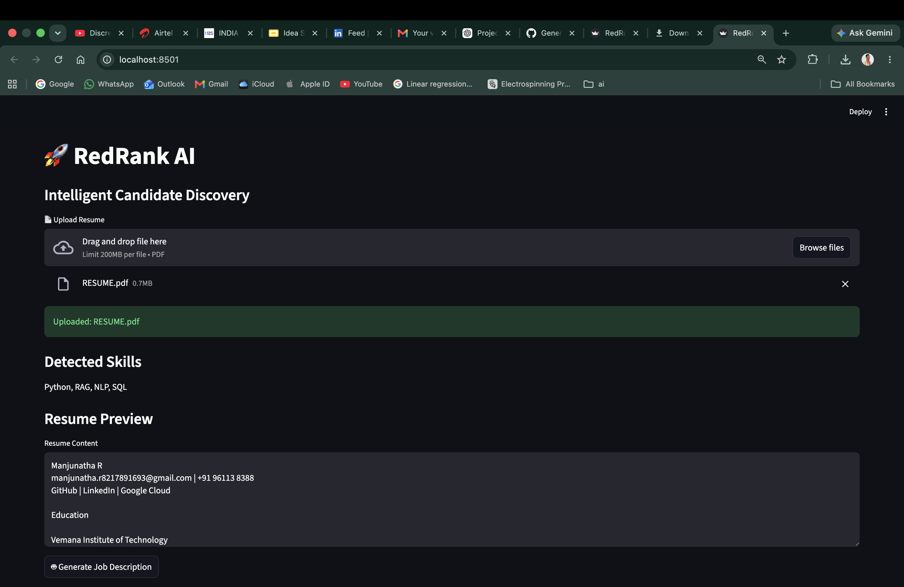
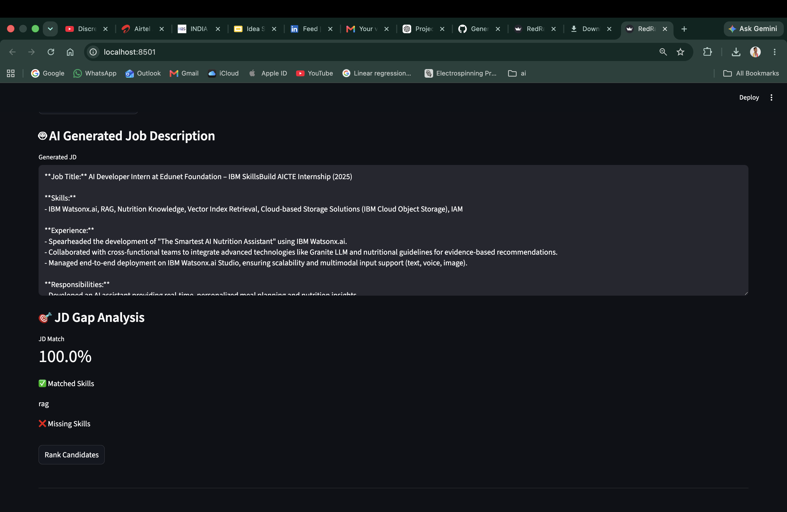
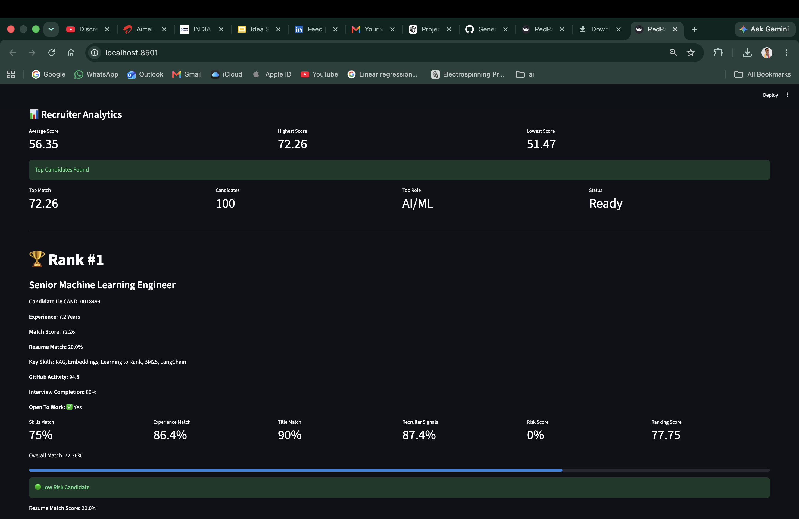
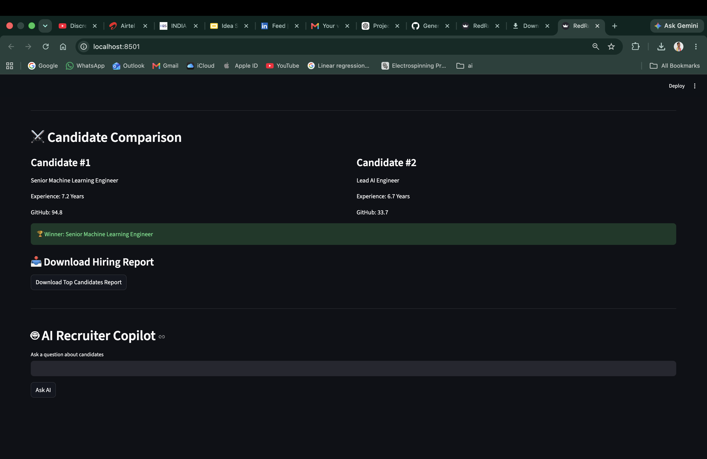
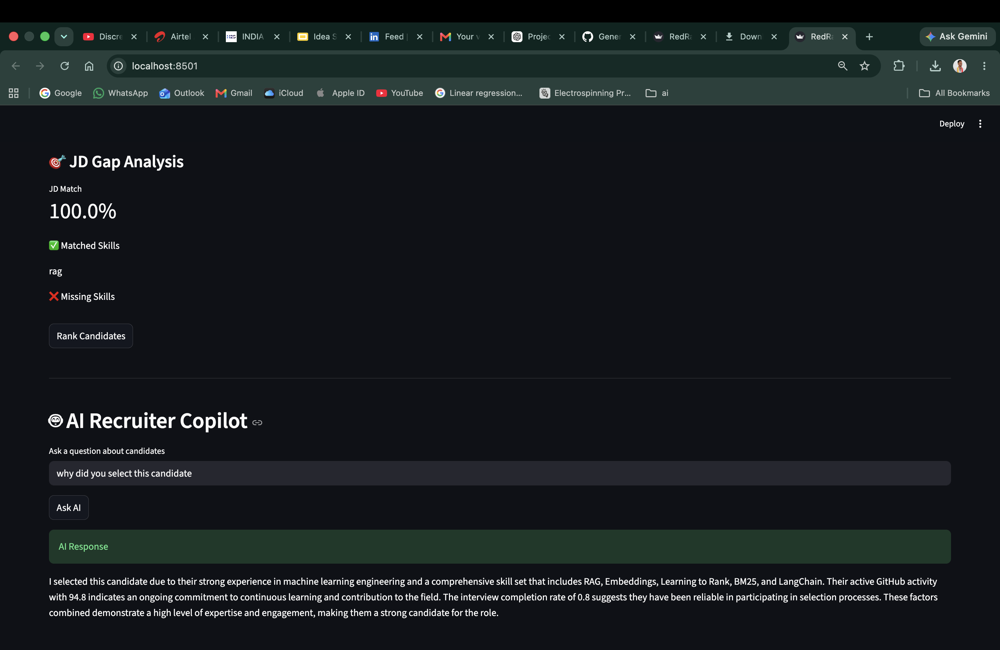

# RedRank AI - Intelligent Candidate Discovery

## Overview

RedRank AI is an intelligent candidate ranking system built for the Redrob India Runs Hackathon.

Traditional hiring systems rely heavily on keyword matching, often missing highly relevant candidates whose skills and experience are expressed differently.

RedRank AI combines semantic retrieval, behavioral signals, experience analysis, and recruiter-focused ranking to identify the best candidates for a given job description.

---

## Problem Statement

Recruiters review thousands of profiles and often miss high-quality candidates because keyword-based systems cannot understand context, relevance, or behavioral indicators.

The goal is to build an AI-powered ranking system that understands both job requirements and candidate profiles.

---

## Solution Architecture

### Stage 1: Candidate Understanding

Each candidate profile is transformed into a unified textual representation using:

* Headline
* Summary
* Skills
* Career History

### Stage 2: Semantic Embedding

Model:

sentence-transformers/all-MiniLM-L6-v2

Embeddings generated:

* 100,000 candidates
* 384-dimensional vectors

### Stage 3: Vector Retrieval

FAISS IndexFlatIP is used for high-speed semantic search.

Process:

Job Description → Embedding → FAISS Search → Top Candidates

### Stage 4: Hybrid Ranking

Features:

* Semantic Similarity
* Keyword Relevance
* Experience Match
* Behavioral Signals
* Title Relevance

Final ranking combines all signals into a unified score.

---
## Stage 5: Fraud Detection & Risk Scoring

To improve shortlist quality and reduce false positives, RedRank AI includes a fraud detection module.

Risk factors considered:

- Skill stuffing
- Low GitHub activity with unusually high experience
- Inconsistent candidate signals
- Low interview completion rates

Risk Levels:

- Low Risk
- Medium Risk
- High Risk

High-risk candidates receive ranking penalties before final ranking.

## Stage 6: Explainability

Every ranking decision is transparent.

For each candidate, the system provides:

- Match Score
- Skills Match
- Experience Match
- Title Match
- Recruiter Signals
- Risk Score
- Final Ranking Score

This helps recruiters understand why a candidate is ranked above another candidate.

## Additional Features

### AI Job Description Generator

Generate professional job descriptions automatically from uploaded resumes using Qwen 2.5 Coder 7B running locally through Ollama.

### JD Gap Analysis

Compare candidate skills against generated job requirements and identify:

- Matched Skills
- Missing Skills
- JD Match Percentage

### Candidate Comparison

Compare top-ranked candidates side by side using:

- Experience
- Skills
- GitHub Activity
- Recruiter Signals

### AI Recruiter Copilot

Ask natural language questions such as:

- Why was Candidate #1 selected?
- Who is the best candidate?
- Compare Candidate #1 and Candidate #2

The assistant generates recruiter-friendly explanations based on candidate data.

## Screenshots

### Resume Upload & Skill Extraction

### AI Generated Job Description

### Candidate Ranking Dashboard

### Candidate Comparison

### AI Recruiter Copilot

## Technologies Used

## Technologies Used

* Python
* Streamlit
* Sentence Transformers
* FAISS
* Ollama
* Qwen2.5-Coder 7B
* Pandas
* NumPy
* Scikit-Learn

---

## Results

* 100,000 profiles processed
* Semantic retrieval implemented
* Hybrid ranking system developed
* Top 100 candidate shortlist generated

---

## Future Improvements

* Cross-encoder reranking
* Learning-to-rank models
* Graph-based candidate similarity
* Recruiter feedback loop
* LLM-powered candidate explanations
